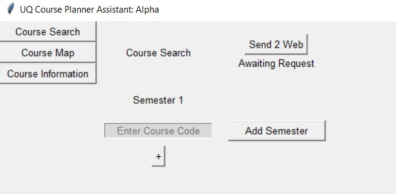
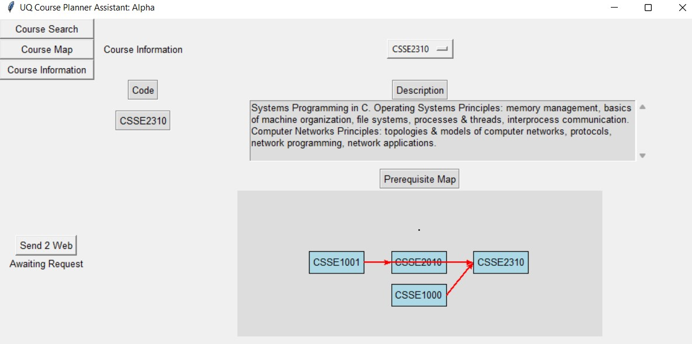

# UQ-Course-Planner
W.I.P. Script to map out the prerequisites for each course

# How to Use
After running the main class a UI should be created.

To search for a course add it to the list and hit to "send 2 web" button.

Going to course information allows you to select the data for one of the courses.
The full course map is not implemented in this release.

# Repository Structure
[main.py](Main.py) contains the applicaiton launcher

[uqCoursePlanner](uqCoursePlanner) contains the different modules for the application in the private package