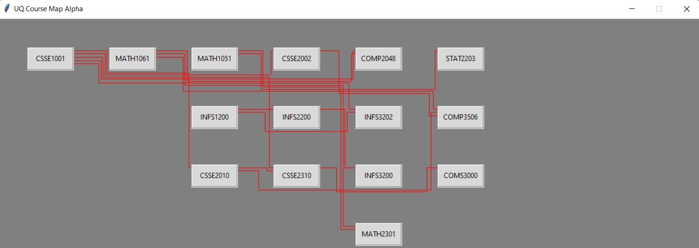

# UQ-Course-Planner
W.I.P. Script to map out the prerequisites for each course
If you choose to use any of the code within the repository I would appreciate a mention

# How to Use
Go into the main section of the coe and then set your courses. Running the code should produce a diagram similar to below.

# Repository Structure
[main.py](Main.py) contains the full code for the project with the different components also available in their respective files